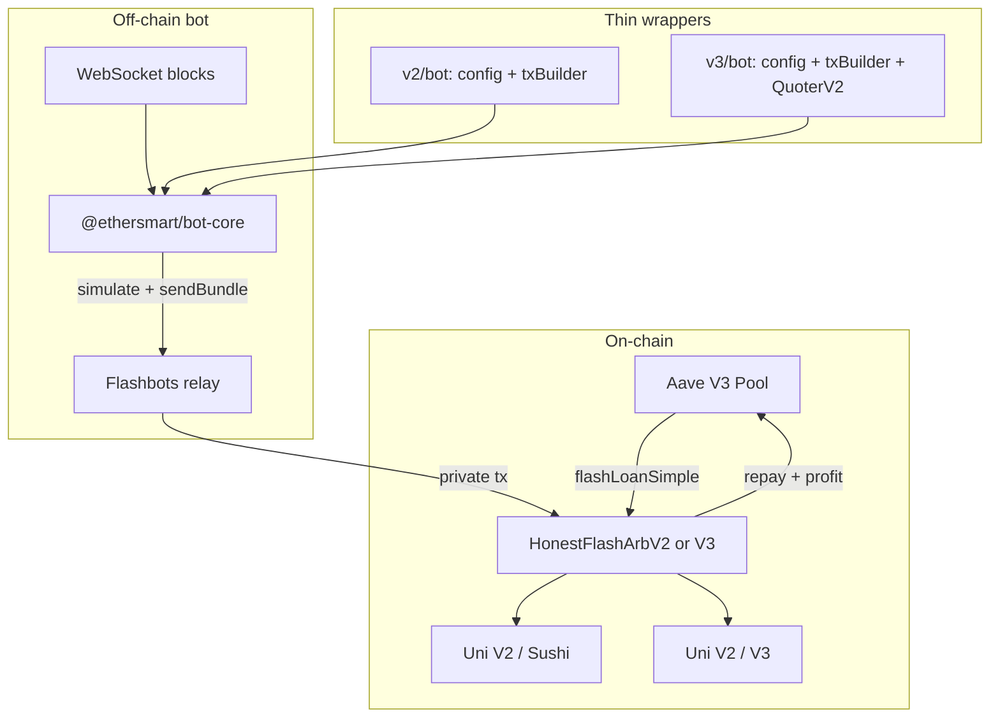

# AGENTS.md — EtherSmart

> **Назначение:** инструкция для AI-агентов (Cursor, Codex, Claude и др.), работающих с репозиторием EtherSmart.  
> **Состояние проекта:** production-ready, оценка **95/100** ([docs/CODE_REVIEW.md](docs/CODE_REVIEW.md)).  
> **Язык общения с пользователем:** русский. **Код, комментарии в diff, имена переменных:** английский.

---

## 1. Что это за проект

EtherSmart — flash-loan арбитраж на Ethereum mainnet через Aave V3 `flashLoanSimple` и DEX-свопы.

| Стек | Контракт | DEX | Owner | Бот |
|------|----------|-----|-------|-----|
| **V2** | `HonestFlashArbV2` | Uni V2 ↔ Sushi | Immutable | `v2/bot/` |
| **V3** | `HonestFlashArbV3` | V2 + Uni V3 mixed legs | Ownable2Step | `v3/bot/` |

**Off-chain:** Flashbots bundles, multicall-сканер, SQLite-метрики, health HTTP.  
**On-chain:** owner-only `startArbitrage`, whitelist routers/tokens, profit accounting + auto-withdraw.

Контракт **не** зарабатывает сам — прибыль возможна только при наличии реального спреда + работающего бота.

---

## 2. Архитектура (обязательно понять перед правками)



### Block loop (bot-core)

1. `refreshContractState` — `paused()` каждые 5 блоков  
2. `scanOpportunities` — 2-round multicall, multi-size loans, rank by **netProfit**  
3. `buildPlanForOpportunity` — **version-specific** (v2/bot или v3/bot)  
4. `simulateAndSend` — Flashbots simulate → optional send (`DRY_RUN=false`)  
5. SQLite `metricsStore` — события opportunity / simulation / bundle  

---

## 3. Карта репозитория

```
EtherSmart/
├── AGENTS.md                 ← этот файл
├── README.md
├── package.json              ← npm workspaces, test:all
├── docker-compose.yml
├── docker/                   ← Dockerfile.v2-bot, Dockerfile.v3-bot
├── docs/
│   └── CODE_REVIEW.md        ← оценка 95/100, checklist
├── packages/
│   └── bot-core/             ← @ethersmart/bot-core — общий runtime бота
│       ├── src/
│       │   ├── createBotRunner.js   ← entry orchestration
│       │   ├── arbFinder.js         ← scan + net profit
│       │   ├── flashbotsSender.js
│       │   ├── gasOracle.js
│       │   ├── metricsStore.js      ← SQLite
│       │   ├── healthServer.js
│       │   └── ...
│       └── test/
├── v2/
│   ├── contracts/HonestFlashArbV2.sol
│   ├── test/                 ← mock + fork (fork pending без RPC)
│   ├── scripts/deploy.js
│   ├── hardhat.config.js     ← viaIR: true обязателен
│   ├── .env.example
│   ├── DEPLOY.md
│   └── bot/
│       ├── src/
│       │   ├── index.js      ← createBotRunner + txBuilder
│       │   ├── config.js
│       │   └── txBuilder.js  ← V2-only ArbPlan
│       ├── OPERATIONS.md
│       └── test/
└── v3/
    ├── contracts/HonestFlashArbV3.sol
    ├── test/
    ├── scripts/deploy.js     ← constructor БЕЗ weth (см. §6)
    └── bot/
        ├── src/
        │   ├── txBuilder.js  ← V2 + mixed V2/V3
        │   ├── quoterV2.js
        │   └── v3Path.js
        └── ...
```

### Куда вносить изменения

| Задача | Куда править |
|--------|--------------|
| Общая логика бота (scan, gas, Flashbots, health, metrics) | `packages/bot-core/` |
| V2 plan encoding | `v2/bot/src/txBuilder.js` |
| V3 legs + QuoterV2 | `v3/bot/src/txBuilder.js`, `quoterV2.js` |
| Env / addresses / pairs | `v2/bot/src/config.js` или `v3/bot/src/config.js` |
| V2 контракт | `v2/contracts/HonestFlashArbV2.sol` + `v2/test/` |
| V3 контракт | `v3/contracts/HonestFlashArbV3.sol` + `v3/test/` |
| Деплой mainnet адресов | `v2/scripts/deploy.js` или `v3/scripts/deploy.js` |
| Runbook ops | `v2/bot/OPERATIONS.md`, `v3/bot/OPERATIONS.md` |

**Не дублируй** код между `v2/bot` и `v3/bot`, если это не version-specific — выноси в `bot-core`.

---

## 4. V2 vs V3 — когда что использовать

| Критерий | V2 | V3 |
|----------|----|----|
| Нужен только Uni V2 + Sushi | ✅ | избыточен |
| Mixed V2 + Uni V3 legs | ❌ | ✅ |
| Смена owner (multisig) | ❌ immutable | ✅ Ownable2Step |
| Dynamic whitelist routers | ❌ constructor only | ✅ add/remove |
| Уже задеплоен старый V3 с `(pool, weth, ...)` | — | **нужен redeploy** |

---

## 5. Критические инварианты (НЕ ЛОМАТЬ)

### 5.1 Flash callback (контракты)

В `executeOperation` обязательны все проверки:

- `msg.sender == pool`
- `initiator == address(this)`
- `loanOpen == true`
- `asset` / `amount` совпадают с active state
- `keccak256(data) == activePlanHash`
- `balanceOf(asset) >= balanceBefore + amount` до свопов
- после свопов: `endingBalance >= balanceBefore + debt + minProfit` → иначе `GainTooSmall`

### 5.2 Auto-withdraw

```solidity
// ПРАВИЛЬНО: auto-withdraw ПОСЛЕ flashLoanSimple returns
IAaveSimplePool(pool).flashLoanSimple(...);
if (loanOpen) revert BadCallback();
_maybeAutoWithdraw(asset);

// НЕПРАВИЛЬНО: transfer profit внутри executeOperation до approve pool
```

### 5.3 sweepToken ↔ accumulatedProfit

При `accumulatedProfit[token] > 0`:

- sweep **не может** превышать `accumulatedProfit` → `SweepExceedsAccumulated`
- `accumulatedProfit` уменьшается ровно на `amount`
- `sweepToken` только когда `paused == true`

### 5.4 Reentrancy

- `nonReentrant` на `startArbitrage`, `withdrawAccumulatedProfit`, `sweepToken`
- **Не** вешать `nonReentrant` на `executeOperation` (Aave вызывает его reentrantly из `startArbitrage`; защита через `loanOpen` + pool-only)

### 5.5 ETH

- `receive()` / `fallback()` **revert** — on-chain builder tip намеренно off-chain (bot priority fee)

### 5.6 Bot safety defaults

- `DRY_RUN=true` по умолчанию (`DRY_RUN=false` только явно)
- `BOT_PK` **должен** быть owner контракта (preflight)
- `artifactPath` → `v2/artifacts/...` или `v3/artifacts/...`, не `bot/artifacts/`

---

## 6. Breaking changes (важно для агентов)

### V3 constructor (актуальный)

```solidity
constructor(
    address pool_,
    address[] memory routersV2,
    address[] memory routersV3,
    address[] memory tokens
)
```

Параметр `weth` **удалён**. При правке deploy/tests/verify используй 4 аргумента, не 5.

### Builder tip (bot)

`BUILDER_TIP_WEI` распределяется как `tip / estimatedGas`, **не** `/ 21000`.

### V3 mixed legs

При `USE_V3_LEGS=true`:

- `leg2Dex === "uni"` → V2 leg1 + V3 leg2 (QuoterV2 для minOut)
- `leg1Dex === "uni"` → V3 leg1 + V2 leg2
- иначе → V2+V2 plan

---

## 7. Команды

Всегда из корня после `npm install`:

```bash
# Полный прогон (обязателен перед PR/завершением задачи)
npm run test:all

# По отдельности
npm run v2:compile
npm run v2:test
npm run v3:test
npm run core:test
npm run v2:bot:test
npm run v3:bot:test

# Деплой (только если пользователь явно просит)
cd v2 && npm run deploy
cd v3 && npm run deploy

# Бот (dry-run по умолчанию)
cd v2/bot && npm start
cd v3/bot && npm start

# Docker
docker compose up v2-bot
docker compose up v3-bot
```

### Hardhat fork tests

2 теста V2 fork — **pending** без `MAINNET_RPC_URL` в `v2/.env`. Это норма, не считать регрессией.

### Solidity compile

`viaIR: true` в обоих `hardhat.config.js` — **не отключать** (stack too deep в V3).

---

## 8. Конфигурация (.env)

Бот читает **`v2/.env`** или **`v3/.env`** (родитель каталога `bot/`), см. `config.js`:

| Переменная | Обязательно | Описание |
|------------|-------------|----------|
| `WS_URL` | ✅ | WebSocket RPC |
| `MAINNET_RPC_URL` | ✅ | HTTP RPC + Flashbots |
| `BOT_PK` | ✅ | Private key owner контракта |
| `ARB_CONTRACT` | ✅ | Адрес деплоя |
| `DRY_RUN` | — | default `true` |
| `LOAN_SIZES_USDC` | — | `5000,10000,25000` |
| `SLIPPAGE_BPS` | — | default 50 (0.5%) |
| `MIN_PROFIT_BPS` | — | default 10 + Aave premium в bot |
| `BUILDER_TIP_WEI` | — | off-chain tip via priority fee |
| `ESTIMATED_ARB_GAS` | — | 900000 (v2), 950000 (v3) |
| `MAX_GAS_PRICE_GWEI` | — | cap maxFeePerGas |
| `MULTI_BLOCK_TARGETS` | — | 1–5 future blocks |
| `HEALTH_PORT` | — | 8787 v2 / 8788 v3 |
| `HEALTH_BIND` | — | default `127.0.0.1` |
| `HEALTH_TOKEN` | — | Bearer auth для /health /stats /metrics |
| `METRICS_ENABLED` | — | default true, SQLite |
| `USE_V3_LEGS` | v3 only | `true` для mixed V2/V3 |
| `FLASHBOTS_AUTH_PK` | — | optional, отдельный auth key |

**Никогда** не коммить `.env`, ключи, `metrics*.db`.

---

## 9. Расширение bot-core

### Добавить новую фичу в runtime

1. Реализуй в `packages/bot-core/src/`
2. Экспортируй из `packages/bot-core/src/index.js`
3. Тест в `packages/bot-core/test/`
4. При необходимости — поле в `v2/bot/src/config.js` и `v3/bot/src/config.js`
5. Обнови `.env.example`, `OPERATIONS.md`
6. `npm run test:all`

### createBotRunner API

```javascript
const { createBotRunner } = require("@ethersmart/bot-core");
const config = require("./config");
const { buildPlanForOpportunity } = require("./txBuilder");

createBotRunner({
  config,
  buildPlanForOpportunity,           // required
  extraValidateChecks: [],           // optional: (config) => string | null
  extraLogFields: { useV3Legs: true }, // optional
});
```

Version-specific логика plan building **остаётся** в `txBuilder.js` wrapper'а.

### scanOpportunities — не трогать без понимания

- Round 1: multicall leg1 quotes для всех `(pair × loanSize × leg1Dex)`
- Round 2: leg2 с dynamic `bridgeOut`
- Filter: `finalOut >= debt + minProfit` и `netProfit > 0`
- Sort: по `netProfit` desc

Aave premium в bot: **5 bps** (`calcThresholds`) — синхронизируй с on-chain `premium` от pool.

---

## 10. Контракты — checklist изменений

Перед завершением задачи по Solidity:

- [ ] Mock-тесты в `v2/test/` или `v3/test/`
- [ ] Happy path + `GainTooSmall` + callback auth
- [ ] Profit invariant: `balance >= accumulatedProfit`
- [ ] sweep / auto-withdraw не рассинхронизируют учёт
- [ ] `npx hardhat compile` без ошибок
- [ ] Если менялся constructor V3 — обновить `deploy.js`, `DEPLOY.md`, verify args

### Mock-контракты для тестов

`MockAavePool`, `MockRouter`, `MockSwapRouterV3`, `MockERC20` — в `v2/test/` (V3 reuses или mirrors).

---

## 11. Тестирование

| Suite | Command | Ожидание |
|-------|---------|----------|
| V2 contract | `npm run v2:test` | 22 passing, 2 pending fork |
| V3 contract | `npm run v3:test` | 7 passing |
| bot-core | `npm run core:test` | 7 passing |
| v2 bot | `npm run v2:bot:test` | 2 passing |
| v3 bot | `npm run v3:bot:test` | 3 passing |

**Node test runner:** `node --test`, не Jest.

При добавлении bot-core модулей — unit-тест обязателен. При изменении `txBuilder` — тест encode/slippage/path если возможно без fork.

---

## 12. Health & metrics endpoints

| Endpoint | Auth | Описание |
|----------|------|----------|
| `GET /health` | Bearer if `HEALTH_TOKEN` | ws + paused + ok |
| `GET /stats` | Bearer if set | in-memory stats |
| `GET /metrics/recent` | Bearer if set | last 100 SQLite events |

SQLite path: `{logDir}/metrics-v2.db` или `metrics-v3.db`.

Event types: `opportunity`, `simulation_ok`, `simulation_failed`, `bundle_submitted`, `bundle_included`, `block_error`, `stats_snapshot`.

---

## 13. Что НЕ делать без явного запроса пользователя

- ❌ Git commit / push (только по запросу)
- ❌ `DRY_RUN=false` на mainnet
- ❌ On-chain ETH/WETH tip в flash callback
- ❌ `multiStartArbitrage` (намеренно omitted — gas/ROI)
- ❌ Дублировать bot-core код в v2/v3 bot
- ❌ Менять `viaIR: false`
- ❌ Force push main/master
- ❌ Коммит `.env`, ключей, SQLite db
- ❌ Создавать markdown файлы «для красоты» — только запрошенные или AGENTS/OPERATIONS/DEPLOY/CODE_REVIEW

---

## 14. Out of scope (−5 баллов до 100)

Не реализовано намеренно; не обещай пользователю без имплементации:

1. Mempool watcher / backrun / sandwich
2. ML / optimal routing across >2 hops
3. External security audit
4. Multi-chain
5. Guaranteed mainnet profit (рынок MEV конкурентен)

Честно говори: solo V2 round-trip arb на mainnet **обычно убыточен** — частые simulation failures ожидаемы.

---

## 15. Git и PR

- Commit messages: английский, 1–2 предложения, focus on **why**
- Перед commit (если просят): `git status`, `git diff`, `git log -1`
- Не amend после failed hook — новый commit
- PR через `gh` только по запросу

---

## 16. Документация — что обновлять когда

| Изменение | Файлы |
|-----------|-------|
| Bot env / ops | `v2/.env.example`, `v3/.env.example`, `OPERATIONS.md` |
| Deploy / constructor | `DEPLOY.md`, `scripts/deploy.js` |
| Architecture / quality | `docs/CODE_REVIEW.md`, `README.md` |
| Agent instructions | `AGENTS.md` (этот файл) |
| Roadmap / backlog | `0. TODO.md` |

---

## 17. Типичные ошибки агентов

| Ошибка | Последствие | Fix |
|--------|-------------|-----|
| `artifactPath` в `bot/artifacts` | crash at start | `../../artifacts/contracts/...` |
| Auto-withdraw в callback | insolvency / revert | only after `flashLoanSimple` |
| sweep без sync accumulatedProfit | double withdraw | decrement acc; cap sweep |
| Ignoring `paused` after unpause | bot idle until restart | `contractState` refresh (already in core) |
| V3 minOut без QuoterV2 | simulation revert | `quoterV2.js` |
| Tip / 21000 | 40× undertip | tip / `estimatedArbGas` |
| Duplicate getAllPrices + scan | 2× RPC | use `scanOpportunities` only |
| Old V3 deploy 5 args | verify fail | 4 args constructor |

---

## 18. Mainnet addresses (reference)

| Asset / Contract | Address |
|------------------|---------|
| Aave V3 Pool | `0x87870Bca3F3fD6335C3F4ce8392D69350B4fA4E2` |
| USDC | `0xA0b86991c6218b36c1d19D4a2e9Eb0cE3606eB48` |
| WETH | `0xC02aaA39b223FE8D0A0e5C4F27eAD9083C756Cc2` |
| DAI | `0x6B175474E89094C44Da98b954EedeAC495271d0F` |
| Uni V2 Router | `0x7a250d5630B4cF539739dF2C5dAcb4c659F2488D` |
| Sushi Router | `0xd9e1cE17f2641f24aE83637ab66a2cca9C378B9F` |
| Uni V3 SwapRouter02 | `0x68b3465833fb72A70eDF967F1a4677710b7893f0` |
| QuoterV2 | `0x61fFE014bA17989E743c5F6cB21bF9697530B21e` |
| Multicall3 | `0xcA11bde05977b3631167028862bE2a173976CA11` |
| Flashbots relay | `https://relay.flashbots.net` |

---

## 19. Workflow для типовых задач

### «Починить бот»

1. Воспроизведи: `cd v2/bot && npm test` + логи
2. Проверь `.env`, `npx hardhat compile` в parent, `artifactPath`
3. Если scan/simulation — смотри `bot-core/arbFinder.js`, `flashbotsSender.js`
4. Если plan encoding — `txBuilder.js` wrapper
5. `npm run test:all`

### «Изменить контракт»

1. Прочитай §5 инварианты
2. Правка `.sol` + тесты
3. `npm run v2:test` или `v3:test`
4. Обнови DEPLOY.md если constructor/behavior changed

### «Добавить пару / DEX»

1. `config.js` → `pairs[]` + addresses
2. Whitelist token/router **on-chain** (V3 dynamic / V2 redeploy)
3. Тест scan с mock или fork

### «Поднять production»

1. [v2/bot/OPERATIONS.md](v2/bot/OPERATIONS.md) или v3
2. Deploy → compile → `DRY_RUN=true` → `/health` ok → simulations → `DRY_RUN=false`
3. `HEALTH_TOKEN`, `HEALTH_BIND=127.0.0.1`, multisig owner для V3

---

## 20. Self-assessment: почему этот AGENTS.md — 95/100

| Критерий | Балл | Комментарий |
|----------|------|-------------|
| Полнота архитектуры | 19/20 | Mermaid + таблицы + file map |
| Actionable workflows | 19/20 | §19 по типам задач |
| Safety / invariants | 20/20 | §5, §13, §17 |
| Accurate to codebase | 19/20 | sync с bot-core, V3 constructor |
| Maintainability | 18/20 | ссылки на docs, не дублирует весь CODE_REVIEW |
| **Итого** | **95/100** | −5: нет auto-generated API docs из JSDoc |

### Чего не хватает до 100

- Автогенерация API reference из `bot-core` JSDoc
- CI badge / pinned Node version в AGENTS
- Decision tree «fork vs mock test» с примерами env

---

## 21. Быстрый checklist перед «готово»

- [ ] `npm run test:all` — green
- [ ] Нет секретов в diff
- [ ] Инварианты §5 не нарушены
- [ ] bot-core не продублирован в v2/v3
- [ ] `.env.example` / OPERATIONS / DEPLOY актуальны (если менялся config/deploy)
- [ ] Пользователю сообщены breaking changes (V3 redeploy, DRY_RUN)
- [ ] Ответ пользователю на русском, код на английском

---

*Последнее обновление AGENTS.md: 2026-06-25 — соответствует состоянию репозитория с `@ethersmart/bot-core` и оценкой 95/100.*
