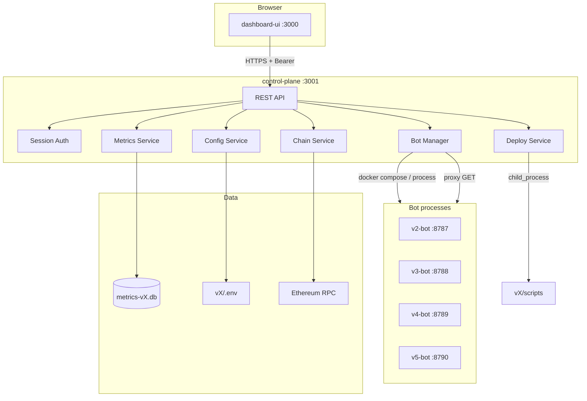

# EtherSmart Control Plane — панель управления и мониторинга

Дата: 2026-06-26  
Статус: **production-ready (Phase 2)** — WebSocket live feed + FlashCompleted indexer

---

## 1. Цели

Единая веб-панель для оператора:

| Функция | Описание |
|---------|----------|
| **Управление ботами** | Start / Stop / Restart V2–V5 через браузер |
| **Деплой** | Запуск `npm run deploy` с логами в UI |
| **Конфигурация** | Редактирование безопасных `.env` параметров |
| **Мониторинг** | Health, stats, WS, paused, dry-run |
| **Балансы** | ETH owner, `accumulatedProfit` на контракте |
| **История** | Opportunities, simulations, bundles, PnL |
| **Сделки** | Таблица `bundle_included` + on-chain tx hash |

---

## 2. Архитектура



### Принципы

1. **Control-plane — единая точка входа** для UI; боты не открываются наружу напрямую.
2. **Боты остаются stateless** — логика арбитража в `bot-core`, панель только оркестрирует.
3. **Секреты** (`BOT_PK`, `DEPLOYER_PK`) в UI **маскируются**, изменение через API с подтверждением.
4. **Деплой** — фоновая job с stream логов; `DEPLOYER_PK` только на сервере.

---

## 3. Компоненты

### 3.1 `packages/control-plane` (API)

| Endpoint | Метод | Описание |
|----------|-------|----------|
| `/api/auth/login` | POST | `{ password }` → session token |
| `/api/bots` | GET | Список ботов + агрегированный статус |
| `/api/bots/:id` | GET | Детали бота |
| `/api/bots/:id/start` | POST | Запуск |
| `/api/bots/:id/stop` | POST | Остановка |
| `/api/bots/:id/restart` | POST | Перезапуск |
| `/api/bots/:id/metrics` | GET | События из SQLite (`?limit=`, `?type=`) |
| `/api/bots/:id/config` | GET | `.env` (секреты замаскированы) |
| `/api/bots/:id/config` | PUT | Обновление whitelist полей |
| `/api/bots/:id/balances` | GET | ETH owner + on-chain profit |
| `/api/bots/:id/pnl` | GET | Агрегат PnL по дням |
| `/api/bots/:id/trades` | GET | История сделок |
| `/api/deploy/jobs` | GET | Список deploy jobs |
| `/api/deploy` | POST | `{ version: "v5" }` → job id |
| `/api/deploy/jobs/:id` | GET | Статус + лог deploy job |
| `/api/audit` | GET | Audit log (start/stop/config/deploy) |
| `/api/health` | GET | **Public** — liveness probe |

**Режимы оркестрации** (`CONTROL_MODE`):

| Режим | Когда | Как |
|-------|-------|-----|
| `docker` | Production VPS | `docker compose start/stop vX-bot` |
| `process` | Local dev | `child_process` spawn `node src/index.js` |

### 3.2 `packages/dashboard-ui` (SPA)

| Страница | Содержание |
|----------|------------|
| **Overview** | Карточки V2–V5: статус, dry-run, blocks, opportunities |
| **Bot** | Start/Stop, live stats, event feed |
| **Config** | Форма безопасных параметров |
| **Deploy** | Wizard: версия → compile? → deploy → лог |
| **PnL** | График net profit по дням |
| **Trades** | Таблица included bundles |
| **Audit** | Журнал действий оператора |

### 3.3 Расширение bot-core (будущее)

Для полного on-chain PnL рекомендуется слушать `FlashCompleted` event в control-plane и писать в общую БД `control-plane/data/trades.db`.

---

## 4. Безопасность

| Риск | Митигация |
|------|-----------|
| Открытый UI без auth | `DASHBOARD_PASSWORD` обязателен в production |
| Утечка private keys | Masking в GET; PUT только с `confirmSecrets` |
| Произвольный deploy | Только whitelist версий v2–v5 |
| Docker socket | Mount только на control-plane контейнер |
| CSRF | Same-origin SPA + Bearer token |
| Rate limit | 10 login attempts / min per IP |
| Session TTL | 24h (configurable `SESSION_TTL_MS`) |
| Audit | SQLite `packages/control-plane/data/audit.db` |

**Production checklist:**

```env
DASHBOARD_PASSWORD=long-random-secret
DASHBOARD_BIND=127.0.0.1   # или reverse proxy + TLS
CONTROL_MODE=docker
```

Nginx/Caddy перед UI с TLS; control-plane на localhost.

---

## 5. PnL и история сделок

### Источники данных

| Источник | Данные |
|----------|--------|
| SQLite `opportunity` | Найденные возможности, gross/net profit |
| SQLite `simulation_ok` / `simulation_failed` | Результат симуляции |
| SQLite `bundle_submitted` / `bundle_included` | Отправка и включение |
| On-chain `accumulatedProfit(token)` | Реальный учёт контракта |
| On-chain `FlashCompleted` event | Точная прибыль per tx (Phase 2) |

### MVP PnL

Агрегация `bundle_included` payload → сумма `netProfit` по дням.  
Если included нет — показываем opportunities как «потенциал» (с пометкой).

---

## 6. Запуск

### Local (process mode)

```bash
# Terminal 1 — API
cd packages/control-plane
copy .env.example .env
npm install
npm start

# Terminal 2 — UI
cd packages/dashboard-ui
npm install
npm run dev
```

UI: http://localhost:3000 → proxy → API :3001

### Docker

```bash
docker compose up control-plane dashboard
```

---

## 7. WebSocket live feed

```
ws://127.0.0.1:3001/api/ws?token=<session_token>
```

| type | Описание |
|------|----------|
| `metric` | Новое событие bot SQLite |
| `flash_completed` | On-chain profit из indexer |
| `bots_snapshot` | Статус V2–V5 |

## 8. FlashCompleted indexer

- DB: `packages/control-plane/data/trades.db`
- Env: `INDEXER_ENABLED`, `INDEXER_FROM_BLOCK`, `MAINNET_RPC_URL`
- API: `/api/bots/:id/flash-trades`, merged в `/trades` и `/pnl`

## 9. Roadmap

| Фаза | Фичи |
|------|------|
| **Phase 3** | Telegram alerts, pause/unpause из UI |
| **Phase 4** | RBAC, Grafana |

---

## 10. Связанные документы

- [DEPLOYMENT_GUIDE.md](DEPLOYMENT_GUIDE.md) — деплой контрактов
- [CODE_REVIEW.md](CODE_REVIEW.md) — оценка качества
- [packages/control-plane/README.md](../packages/control-plane/README.md) — API reference
