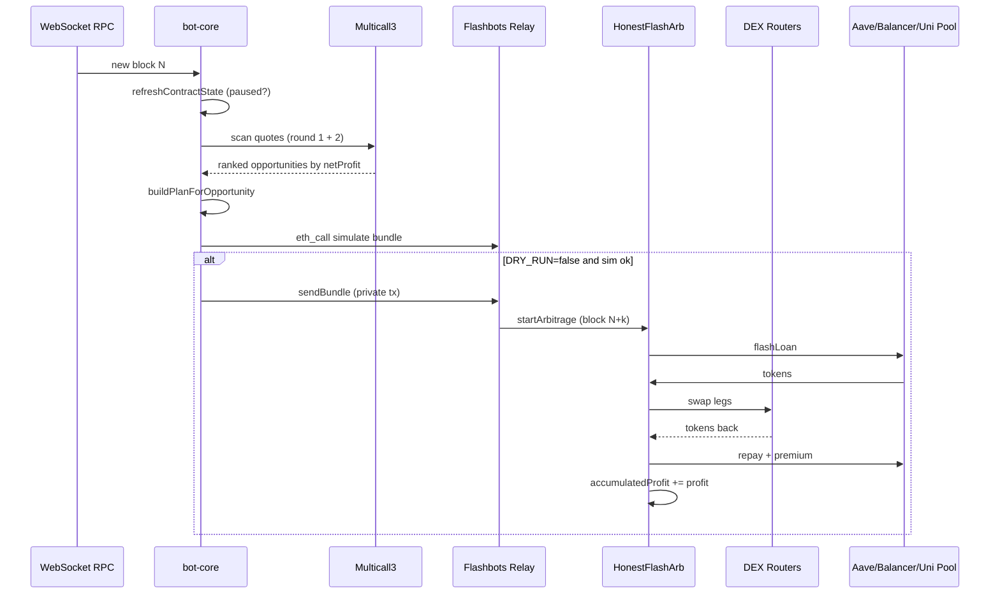

# Полное руководство по деплою EtherSmart (V2–V5)

Дата: 2026-06-26  
Аудитория: оператор, который впервые поднимает контракт и бота на Ethereum mainnet.

> **Главное:** контракт **не зарабатывает сам**. Прибыль возможна только при реальном ценовом спреде между DEX и работающем off-chain боте. Solo 2-hop арбитраж на mainnet **часто убыточен** — это нормально.

---

## Содержание

1. [Какую версию выбрать](#1-какую-версию-выбрать)
2. [Что нужно заранее (кошельки, RPC, ключи)](#2-что-нужно-заранее)
3. [Деньги: что пополнять, сколько и где брать](#3-деньги-что-пополнять-сколько-и-где-брать)
4. [Алгоритм работы системы](#4-алгоритм-работы-системы)
5. [Общий пайплайн деплоя](#5-общий-пайплайн-деплоя)
6. [V2 — пошагово](#6-v2--пошагово)
7. [V3 — пошагово](#7-v3--пошагово)
8. [V4 — пошагово](#8-v4--пошагово)
9. [V5 — пошагово](#9-v5--пошагово)
10. [Запуск бота: dry-run → production](#10-запуск-бота-dry-run--production)
11. [Вывод прибыли](#11-вывод-прибыли)
12. [Мониторинг и health](#12-мониторинг-и-health)
13. [Частые ошибки](#13-частые-ошибки)
14. [Шпаргалка адресов mainnet](#14-шпаргалка-адресов-mainnet)

---

## 1. Какую версию выбрать

| Версия | Когда использовать | Flash-источники | Сканер | Health |
|--------|-------------------|-----------------|--------|--------|
| **V2** | Только Uni V2 + Sushi, 2 ноги, минимальная сложность | Aave V3 | 2-hop пары | `:8787` |
| **V3** | Mixed V2 + Uni V3 ноги, смена owner (multisig) | Aave V3 | 2-hop + QuoterV2 | `:8788` |
| **V4** | Tri-hop 3–6 ног, Curve + Balancer | Aave / Balancer Vault | Фиксированные треугольники | `:8789` |
| **V5** | Graph cycles 3–4 hop, Uni V3 pool flash, mempool re-scan | Aave / Balancer / Uni pool | `graphEdges` | `:8790` |

**Рекомендация для новичка:** начните с **V2** или **V3** на `DRY_RUN=true`, изучите метрики, затем переходите к V4/V5.

---

## 2. Что нужно заранее

### 2.1 Кошельки (рекомендуемая схема)

| Кошелёк | Переменная | Назначение |
|---------|------------|------------|
| Deployer | `DEPLOYER_PK` | Одноразовый деплой контракта |
| Bot owner | `BOT_PK` | **Должен быть `owner()` контракта** — подписывает `startArbitrage` |
| Flashbots auth (опц.) | `FLASHBOTS_AUTH_PK` | Репутация у Flashbots relay; может совпадать с `BOT_PK` |

**Безопасность:**
- Генерируйте ключи офлайн (MetaMask, `cast wallet new`, hardware wallet).
- Никогда не коммитьте `.env`.
- На production рассмотрите multisig как owner (V3/V4/V5 через `Ownable2Step`).

### 2.2 RPC-провайдеры

Нужны **два** endpoint'а на mainnet:

| Тип | Переменная | Зачем |
|-----|------------|-------|
| WebSocket | `WS_URL` | Подписка на новые блоки (block loop) |
| HTTP | `MAINNET_RPC_URL` | Multicall-скан, симуляция Flashbots, deploy |

Провайдеры: [Alchemy](https://www.alchemy.com/), [Infura](https://infura.io/), [QuickNode](https://www.quicknode.com/), [Ankr](https://www.ankr.com/).

**Тариф:** для бота нужен платный план с WS (free tier часто режет concurrent requests). Ориентир: **$50–200/мес** на RPC при активном скане.

### 2.3 Etherscan (опционально)

`ETHERSCAN_API_KEY` — для автоматической верификации после `npm run deploy`.

### 2.4 Сервер

- Linux VPS или домашний сервер с uptime 24/7.
- Node.js 18+ (рекомендуется LTS).
- Открытый наружу порт **не нужен** — health bind `127.0.0.1` + SSH tunnel.

---

## 3. Деньги: что пополнять, сколько и где брать

### 3.1 Важно: ERC20 на контракт класть НЕ нужно

Flash-loan арбитраж **сам занимает** капитал:

- **Aave V3** — `flashLoanSimple` (premium ~5 bps)
- **Balancer Vault** — `flashLoan` (0 bps в боте)
- **Uni V3 pool** (V5) — `flash` из пула (0 bps в боте)

Контракту **не нужны** USDC/WETH/DAI до старта. Весь цикл: borrow → swap → swap → repay → profit остаётся в контракте.

Контракт **отклоняет входящий ETH** (`receive()` / `fallback()` revert) — on-chain tip запрещён намеренно.

### 3.2 Что реально нужно пополнить

| Кому | Что | Сколько (mainnet) | Зачем |
|------|-----|-------------------|-------|
| **Deployer** | ETH | **0.05–0.15 ETH** | Gas деплоя контракта (зависит от base fee) |
| **Bot owner** (`BOT_PK`) | ETH | **≥ 0.05 ETH** (мин.), **0.1–0.3 ETH** (комфорт) | Gas при включённых bundle; priority fee (builder tip) |
| **Контракт** | — | **0** | Flash loan даёт ликвидность |
| **Контракт** | ERC20 | **0** | Не требуется для старта |

`MIN_ETH_BALANCE=0.05` в `.env` — порог предупреждения в логах, не hard limit.

### 3.3 Где взять ETH

| Способ | Комментарий |
|--------|-------------|
| CEX (Binance, OKX, Coinbase, Kraken) | Купить ETH → withdraw на адрес deployer / bot owner |
| On-ramp (MoonPay, Transak) | Прямо на кошелёк, выше комиссия |
| Bridge (если ETH на L2) | Official bridge на mainnet |
| Sepolia faucet | **Только для тестов**, не mainnet |

**Не покупайте USDC/WETH для деплоя бота** — они не участвуют в flash borrow на старте.

### 3.4 Сколько ETH уйдёт на gas (ориентиры)

Оценки при `MAX_GAS_PRICE_GWEI=120`:

| Операция | Gas units (оценка) | ETH @ 30 gwei | ETH @ 120 gwei |
|----------|-------------------|---------------|----------------|
| Deploy V2 | ~3–4M | ~0.09 | ~0.36 |
| Deploy V5 | ~5–8M | ~0.15 | ~0.60 |
| 1 включённый arb tx | 900k–1.2M | ~0.027 | ~0.11 |
| Flashbots simulate | 0 (off-chain) | 0 | 0 |

При `DRY_RUN=true` реальные bundle **не отправляются** — ETH на bot owner почти не тратится (только RPC).

### 3.5 Builder tip (опционально)

```env
BUILDER_TIP_WEI=1000000000000000   # 0.001 ETH total tip budget per tx attempt
```

Tip распределяется как `BUILDER_TIP_WEI / ESTIMATED_ARB_GAS` → `maxPriorityFeePerGas`. Списывается с **ETH баланса bot owner**, не с контракта.

### 3.6 Откуда берётся прибыль (выход)

После успешного arb прибыль — **ERC20** (обычно USDC) на балансе контракта:

- `accumulatedProfit[token]` — учёт
- `profitReceiver` — получатель auto-withdraw / manual withdraw
- Настройте `setProfitReceiver` на свой cold wallet или multisig

---

## 4. Алгоритм работы системы

### 4.1 Общая схема



### 4.2 Block loop (одинаков для всех версий)

1. **WebSocket** получает номер нового блока.
2. **`refreshContractState`** — каждые 5 блоков читает `paused()`; если paused — skip.
3. **`scanOpportunities*`** — version-specific сканер:
   - Round 1: котировки первой ноги (multicall)
   - Round 2: котировки второй ноги с dynamic `bridgeOut`
   - Фильтр: `finalOut >= debt + minProfit`, `netProfit > 0`
   - Сортировка по `netProfit` desc
4. **`buildPlanForOpportunity`** — wrapper (`v2/bot`, `v3/bot`, …) кодирует план + slippage.
5. **`simulateAndSend`** — Flashbots `eth_callBundle`; при `DRY_RUN=false` — отправка bundle на block+1…+N.
6. **SQLite metrics** — `opportunity`, `simulation_ok`, `simulation_failed`, `bundle_submitted`.

### 4.3 On-chain (flash callback)

Внутри `startArbitrage` → flash lender вызывает callback (`executeOperation` / Balancer / `uniswapV3FlashCallback`):

1. Проверки: `msg.sender == pool`, `initiator == this`, `loanOpen`, hash плана, whitelist.
2. `balanceBefore + amount` до свопов.
3. Выполнение свопов по плану.
4. `endingBalance >= balanceBefore + debt + minProfit` иначе `GainTooSmall`.
5. Approve lender, закрытие займа.
6. **После** return flash loan: `_maybeAutoWithdraw`, проверка `loanOpen == false`.

### 4.4 Различия сканеров по версиям

| Версия | Сканер | Маршрут |
|--------|--------|---------|
| V2 | `scanOpportunities` | USDC↔WETH, USDC↔DAI на Uni vs Sushi (2-hop) |
| V3 | `scanOpportunities` + `USE_V3_LEGS` | 2-hop V2 или mixed V2+V3 (QuoterV2 для minOut) |
| V4 | `scanOpportunitiesV4` | Треугольники из `config.triangles` (3–6 ног, Curve/Balancer) |
| V5 | `scanOpportunitiesV5` | DFS по `graphEdges`, циклы 3–4 hop |

### 4.5 V5 mempool (опционально)

`USE_MEMPOOL=true`: watcher декодирует pending V2 swaps по токенам графа → флаг `pendingMempoolScan` → re-scan на следующем блоке. **Auto-backrun bundle не подключён** — только ускоренный скан + метрика `mempool_trigger`.

---

## 5. Общий пайплайн деплоя

```bash
# Из корня репозитория
cd c:\Projects\EtherSmart   # или ваш путь
npm install
```

Для каждой версии `vX/`:

```
┌─────────────────────────────────────────────────────────────┐
│ 1. copy .env.example → .env                                 │
│ 2. Заполнить DEPLOYER_PK, MAINNET_RPC_URL, ETHERSCAN_API_KEY│
│ 3. npm install && npm run compile && npm test               │
│ 4. Пополнить deployer ETH (0.05–0.15)                       │
│ 5. npm run deploy                                           │
│ 6. Записать ARB_CONTRACT в vX/.env                          │
│ 7. BOT_PK = owner (или transferOwnership)                   │
│ 8. npm run compile (артефакт для бота)                      │
│ 9. Настроить vX/.env: WS_URL, BOT_PK, DRY_RUN=true          │
│10. cd bot && npm start                                      │
│11. Проверить /health                                        │
│12. DRY_RUN=false только после simulation_ok                  │
└─────────────────────────────────────────────────────────────┘
```

---

## 6. V2 — пошагово

### 6.1 Контракт

```bash
cd v2
copy .env.example .env
npm install
npx hardhat compile
npx hardhat test
```

**`.env` для деплоя:**
```env
DEPLOYER_PK=0x...
MAINNET_RPC_URL=https://eth-mainnet.g.alchemy.com/v2/...
ETHERSCAN_API_KEY=...
```

**Деплой mainnet:**
```bash
npm run deploy
```

Конструктор: `(pool, routers[], tokens[])`

Mainnet defaults в `scripts/deploy.js`:
- Pool: Aave V3 `0x87870Bca3F3fD6335C3F4ce8392D69350B4fA4E2`
- Routers: Uni V2, Sushi
- Tokens: USDC, WETH, DAI

**Верификация вручную:**
```bash
npx hardhat verify --network mainnet <ADDR> \
  "0x87870Bca3F3fD6335C3F4ce8392D69350B4fA4E2" \
  "[0x7a250d5630B4cF539739dF2C5dAcb4c659F2488D,0xd9e1cE17f2641f24aE83637ab66a2cca9C378B9F]" \
  "[0xA0b86991c6218b36c1d19D4a2e9Eb0cE3606eB48,0xC02aaA39b223FE8D0A0e5C4F27eAD9083C756Cc2,0x6B175474E89094C44Da98b954EedeAC495271d0F]"
```

### 6.2 После деплоя (on-chain настройка)

```bash
npx hardhat console --network mainnet
```

```javascript
const arb = await ethers.getContractAt("HonestFlashArbV2", "<ADDR>");
await arb.setProfitReceiver("0xYourColdWallet");
await arb.setAutoWithdrawThreshold(
  "0xA0b86991c6218b36c1d19D4a2e9Eb0cE3606eB48", // USDC
  100_000000n  // 100 USDC — выводить автоматически при накоплении
);
```

**Ограничения V2:**
- `owner` **immutable** — сменить нельзя
- Whitelist routers/tokens **только в конструкторе**

### 6.3 Бот V2

```env
# v2/.env
ARB_CONTRACT=0x...
WS_URL=wss://...
MAINNET_RPC_URL=https://...
BOT_PK=0x...          # тот же адрес, что owner при деплое
DRY_RUN=true
LOAN_SIZES_USDC=5000,10000,25000
HEALTH_PORT=8787
```

```bash
cd v2/bot
npm install
npm test
npm start
```

Подробнее: [v2/bot/OPERATIONS.md](../v2/bot/OPERATIONS.md)

---

## 7. V3 — пошагово

### 7.1 Контракт

```bash
cd v3
copy .env.example .env
npm install
npx hardhat compile
npm test
npm run deploy
```

Конструктор: `(pool, routersV2[], routersV3[], tokens[])` — **без `weth`**.

### 7.2 После деплоя

```javascript
const arb = await ethers.getContractAt("HonestFlashArbV3", "<ADDR>");
await arb.setProfitReceiver("0x...");
// Опционально: multisig
// await arb.transferOwnership("0xMultisig");
// multisig вызывает acceptOwnership()
// Динамический whitelist:
// await arb.addRouterV3("0x68b3465833fb72A70eDF967F1a4677710b7893f0");
```

### 7.3 Бот V3

```env
# v3/.env
ARB_CONTRACT=0x...
USE_V3_LEGS=false    # true для mixed V2+V3
HEALTH_PORT=8788
ESTIMATED_ARB_GAS=950000
```

При `USE_V3_LEGS=true` бот использует QuoterV2 (`0x61fFE014bA17989E743c5F6cB21bF9697530B21e`) для minOut на V3 ногах.

Подробнее: [v3/bot/OPERATIONS.md](../v3/bot/OPERATIONS.md)

---

## 8. V4 — пошагово

### 8.1 Контракт

```bash
cd v4
copy .env.example .env
npm install
npm run compile
npm run deploy
```

Конструктор:
```solidity
(pool, balancerVault, routersV2[], routersV3[], curvePools[], tokens[])
```

Mainnet: + Balancer Vault, Curve 3pool, USDT в whitelist.

### 8.2 Flash source

| `FLASH_SOURCE` | Источник | Premium |
|----------------|----------|---------|
| `0` | Aave (default) | 5 bps |
| `1` | Balancer Vault | 0 |

### 8.3 Бот V4

```env
ARB_CONTRACT=0x...
FLASH_SOURCE=0
ESTIMATED_ARB_GAS=1100000
HEALTH_PORT=8789
USE_MEMPOOL=false
```

Треугольники скана — в `v4/bot/src/config.js` (`triangles`).

Подробнее: [v4/bot/OPERATIONS.md](../v4/bot/OPERATIONS.md)

---

## 9. V5 — пошагово

### 9.1 Контракт

```bash
cd v5
copy .env.example .env
npm install
npm run compile
npm test
npm run deploy
```

Конструктор совпадает с V4 (6 параметров).

### 9.2 Дополнительно для V5

**Uni V3 pool flash** (`FLASH_SOURCE=2`):

1. On-chain: `addUniV3Pool(poolAddress)` от owner
2. В `.env`:
   ```env
   FLASH_SOURCE=2
   UNI_V3_FLASH_POOL=0x...
   ```
3. В `config.js` — `uniV3FlashMeta.token0` / `token1` должны совпадать с пулом
4. `graphLoanToken` должен быть `token0` или `token1` пула

### 9.3 Бот V5

```env
ARB_CONTRACT=0x...
FLASH_SOURCE=0
ESTIMATED_ARB_GAS=1200000
HEALTH_PORT=8790
USE_MEMPOOL=false
```

Граф скана — `graphEdges` в `v5/bot/src/config.js`. Preflight: `validateV5Config` (непустой граф, валидный flash source).

Подробнее: [v5/bot/OPERATIONS.md](../v5/bot/OPERATIONS.md), [v5/DEPLOY.md](../v5/DEPLOY.md)

---

## 10. Запуск бота: dry-run → production

### Фаза 1 — Dry-run (обязательно, 24–72 часа)

```env
DRY_RUN=true
```

- Бот сканирует каждый блок, логирует opportunities.
- Flashbots **симулирует** bundle, но **не отправляет**.
- ETH на bot owner почти не расходуется.
- Смотрите `simulation_ok` vs `simulation_failed` в метриках.

### Фаза 2 — Проверки

```bash
curl http://127.0.0.1:8787/health   # порт зависит от версии
```

Ожидаемый ответ: `"ok": true`, `ws.connected: true`, `contractPaused: false`.

```bash
curl -H "Authorization: Bearer YOUR_TOKEN" \
  http://127.0.0.1:8787/metrics/recent
```

### Фаза 3 — Production

```env
DRY_RUN=false
HEALTH_TOKEN=random-long-secret
HEALTH_BIND=127.0.0.1
MIN_ETH_BALANCE=0.1
BUILDER_TIP_WEI=0    # увеличить при конкуренции
```

Пополните bot owner до **≥ 0.1 ETH**.

### Фаза 4 — PM2 / Docker

```bash
# PM2
cd v2/bot
pm2 start src/index.js --name ethersmart-v2 --cwd ..

# Docker
docker compose up v2-bot   # v3-bot, v4-bot, v5-bot
```

---

## 11. Вывод прибыли

| Механизм | Когда | Как |
|----------|-------|-----|
| **Auto-withdraw** | `accumulatedProfit >= threshold` | `setAutoWithdrawThreshold(token, amount)` |
| **Manual** | anytime | `withdrawAccumulatedProfit(token)` (owner) |
| **Sweep** | только `paused == true` | `sweepToken(token, to, amount)` — emergency |

Прибыль приходит в **ERC20 на `profitReceiver`**, не в ETH.

Пример: накопилось 500 USDC → auto-withdraw на cold wallet при threshold 100 USDC.

---

## 12. Мониторинг и health

| Версия | Port | SQLite DB |
|--------|------|-----------|
| V2 | 8787 | `v2/logs/metrics-v2.db` |
| V3 | 8788 | `v3/logs/metrics-v3.db` |
| V4 | 8789 | `v4/logs/metrics-v4.db` |
| V5 | 8790 | `v5/logs/metrics-v5.db` |

**События:** `opportunity`, `simulation_ok`, `simulation_failed`, `bundle_submitted`, `bundle_included`, `block_error`, `mempool_trigger` (v4/v5).

**Алерты (ручные):**
- `ok: false` в `/health` > 5 мин
- `blockErrors` растёт
- ETH bot owner < `MIN_ETH_BALANCE`
- 0 `simulation_ok` за 24h при активном рынке — возможно нет спреда (норма)

---

## 13. Частые ошибки

| Ошибка | Причина | Решение |
|--------|---------|---------|
| `Signer is not contract owner` | `BOT_PK` ≠ owner | Используйте deployer key или `transferOwnership` |
| `artifact not found` | Нет compile | `cd vX && npm run compile` |
| `bundle simulation failed` / `GainTooSmall` | Нет реального арба | Ожидаемо на mainnet; не включайте `DRY_RUN=false` |
| `ContractPaused` | `pause()` вызван | `unpause()` от owner |
| `graphEdges must not be empty` (V5) | Пустой граф | Заполните `config.js` |
| `FLASH_SOURCE=2 requires pool` | Нет Uni pool meta | `UNI_V3_FLASH_POOL` + `addUniV3Pool` |
| Low ETH warning | Мало gas | Пополните bot owner |
| WS disconnect | RPC лимит | Смените провайдера / tier |

---

## 14. Шпаргалка адресов mainnet

| Контракт | Адрес |
|----------|--------|
| Aave V3 Pool | `0x87870Bca3F3fD6335C3F4ce8392D69350B4fA4E2` |
| Balancer Vault | `0xBA12222222228d8Ba445958a75a0704d566BF2C8` |
| USDC | `0xA0b86991c6218b36c1d19D4a2e9Eb0cE3606eB48` |
| WETH | `0xC02aaA39b223FE8D0A0e5C4F27eAD9083C756Cc2` |
| DAI | `0x6B175474E89094C44Da98b954EedeAC495271d0F` |
| USDT | `0xdAC17F958D2ee523a2206206994597C13D831ec7` |
| Uni V2 Router | `0x7a250d5630B4cF539739dF2C5dAcb4c659F2488D` |
| Sushi Router | `0xd9e1cE17f2641f24aE83637ab66a2cca9C378B9F` |
| Uni V3 SwapRouter02 | `0x68b3465833fb72A70eDF967F1a4677710b7893f0` |
| QuoterV2 | `0x61fFE014bA17989E743c5F6cB21bF9697530B21e` |
| Curve 3pool | `0xbEbc44782C7Db0a1A60Cb6fe97d0b48303205716` |
| Multicall3 | `0xcA11bde05977b3631167028862bE2a173976CA11` |
| Flashbots relay | `https://relay.flashbots.net` |

---

## Связанные документы

| Документ | Содержание |
|----------|------------|
| [docs/DASHBOARD.md](DASHBOARD.md) | **Панель управления** — start/stop, deploy, PnL, балансы |
| [v2/DEPLOY.md](../v2/DEPLOY.md) | Краткий деплой V2 |
| [v3/DEPLOY.md](../v3/DEPLOY.md) | Краткий деплой V3 |
| [v4/DEPLOY.md](../v4/DEPLOY.md) | Краткий деплой V4 |
| [v5/DEPLOY.md](../v5/DEPLOY.md) | Краткий деплой V5 |
| [AGENTS.md](../AGENTS.md) | Инструкция для разработчиков |
| [docs/CODE_REVIEW.md](CODE_REVIEW.md) | Оценка качества 97/100 |
